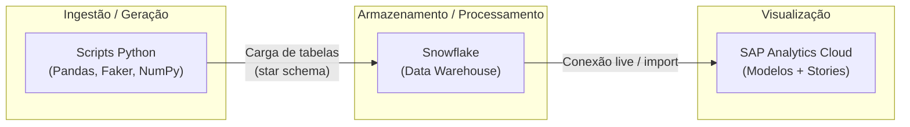

# Modern-Data-Stack-SAC-Snowflake

[](https://www.python.org/)
[](https://www.snowflake.com/)
[](https://www.sap.com/)
[](https://www.sap.com/products/technology-platform/cloud-analytics.html)

> Projeto de portfólio integrante do **Desenvolvimento-Full-SAP-Labs** — demonstração de atuação ponta a ponta: **engenharia de dados**, **modelagem dimensional** e **analytics executivo** sobre um cenário FI/CO próximo ao SAP S/4HANA.

---

## Visão Geral do Projeto

Consultorias e times de dados precisam frequentemente demonstrar cenários financeiros fiéis ao SAP antes de investir em integrações complexas ou em ambientes productivos caros.

Este repositório endereça esse problema ao **simular um ambiente SAP S/4HANA altamente realista**: dados transacionais e de relatórios padrão (incluindo perspectivas alinhadas a **CDS** e consultas típicas como **FBL1N** / **FBL5N**) são gerados por scripts Python, materializados em **Snowflake** como warehouse analítico e, em seguida, consumidos no **SAP Analytics Cloud (SAC)** para **painéis executivos** (DRE, Fluxo de Caixa, Balanço Patrimonial, Contas a Pagar / Contas a Receber).

**Solução arquitetada:** um pipeline claro — **mock SAP com regras de negócio** → **landing e modelagem no Snowflake** → **Stories e dashboards no SAC**.

---

## Arquitetura de Dados

O fluxo foi desenhado para refletir um **pipeline analítico moderno**, com separação entre origem simulada, armazenamento analítico e camada de consumo.



1. **Ingestão / geração (Python):** geração em volume de linhas que emulam granularidade de **documentos contábeis** e visões de negócio (FI e correlatos), com coerência entre campos e regras S/H, status de partida e cadastros mestres onde aplicável.
2. **Snowflake:** atua como **data warehouse em nuvem**, recebendo dados transacionais e mestres modelados de forma **star schema** (fatos e dimensões) para consultas analíticas performáticas.
3. **SAP SAC:** conexão ao Snowflake para **modelagem de dimensões**, definição de medidas e construção de **Stories** com foco em leitura executiva (DRE, caixa, balanço, AP/AR).

---

## Modelagem de Dados (SAP Mocking)

O diferencial deste portfólio não é “gerar números aleatórios”, e sim **preservar a semântica SAP FI/CO** na geração linha a linha:

| Aspecto | Abordagem |
|--------|-----------|
| **Débito / Crédito (S/H)** | Montantes e códigos alinhados: por exemplo, em **Contas a Pagar** (KR/RE/KZ) e **Contas a Receber** (RV/DR/DZ), o sinal do valor respeita a lógica de **débito positivo** e **crédito negativo** conforme o tipo de documento. |
| **Partidas abertas e compensadas** | Campos como `DocumentStatus`, `ValorTotalAberto`, `ValorTotalCompensado`, `ClearingDate` e `ClearingDocument` são preenchidos de forma **mutuamente consistente** (aberto sem compensação; compensado com totais e datas coerentes). |
| **Ledger e estrutura contábil** | Scripts de demonstração (ex.: DRE, Balanço) consideram **ledger**, período fiscal e contas com grupos e naturezas plausíveis para relatórios de BP e DRE. |
| **Dados mestres** | Onde o caso de uso exige (AP/AR), **clientes e fornecedores** vêm de cadastros fixos com **CNPJ e nomes estáveis** por código, evitando ruído de `Faker` solto em campos chave. |
| **Alinhamento a CDS** | Artefatos em `CDS/` documentam a intenção de mapeamento para **CDS Views** ZI\_* usadas como contrato conceitual entre o mock e o consumo analítico. |

Essa disciplina reduz inconsistências típicas de dados sintéticos e aproxima o exercício do que arquitetos e consultores esperam ver em **provas de conceito** e **demos para C-level**.

---

## Tecnologias Utilizadas

| Camada | Tecnologia |
|--------|------------|
| Geração e qualidade dos dados | Python 3, **Pandas**, **NumPy**, **Faker**, **tqdm** |
| Armazenamento e SQL analítico | **Snowflake** (tabelas fato/dimensão, star schema) |
| Visualização executiva | **SAP Analytics Cloud** (modelo de dados, Stories) |
| Contexto SAP | Semântica **S/4HANA FI/CO**, referência a CDS e relatórios operacionais (FBL1N, FBL5N) |

---

## Estrutura do Repositório (resumo)

| Caminho | Descrição |
|---------|-----------|
| `src/` | Scripts geradores `zi_*.py` (CSV de saída alinhados às views ZI) |
| `CDS/` | Definições CDS (ABAP) como referência de contrato de dados |
| `data/` | Saída dos CSV gerados (ex.: `DRE.csv`, `Contas_Pagar.csv`, …) |
| `requerimenyts.py` | Lista auxiliar das dependências Python externas |

---

## Como Executar

**Pré-requisitos:** Python 3 instalado.

1. Clone o repositório e entre na pasta raiz do projeto.

2. Crie um ambiente virtual (recomendado) e instale as dependências:

   ```bash
   python -m venv .venv
   .venv\Scripts\activate
   pip install numpy pandas faker tqdm
   ```

   (Opcional: `python requerimenyts.py` lista os pacotes esperados.)

3. Execute os geradores desejados a partir da **raiz** do repositório. Exemplos:

   ```bash
   python src/zi_dre.py
   python src/zi_balanco_patrimonial.py
   python src/zi_fluxo_caixa.py
   python src/zi_contas_pagar.py
   python src/zi_contas_receber.py
   ```

4. Os arquivos CSV são gravados em **`data/`** (a pasta é criada automaticamente se não existir).

Por padrão, vários scripts geram volumes elevados (da ordem de **cem mil linhas** ou mais) para simular carga analítica; ajuste o parâmetro `linhas` na função `gerar_*` do script, se quiser execuções mais rápidas para testes locais.

---

## Próximos Passos (evolução natural do portfólio)

- Documentar o **modelo star schema** no Snowflake (nomes de tabelas, chaves e grain).
- Incluir diagramas de **linhagem** (fonte mock → Snowflake → SAC).
- Automatizar carga (ex.: Snowpipe / tasks) e versionamento de **modelos SAC**.

---

**Autor:** portfólio **Desenvolvimento-Full-SAP-Labs** — Modern-Data-Stack-SAC-Snowflake.
