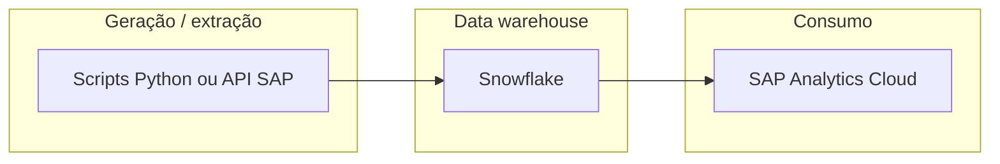

# Modern-Data-Stack-SAP-Snowflake

[](https://www.python.org/)
[](https://www.snowflake.com/)
[](https://www.sap.com/)
[](https://www.sap.com/products/technology-platform/cloud-analytics.html)

> Projeto de portfólio integrante do **Desenvolvimento-Full-SAP-Labs**: engenharia de dados e analytics executivo (**SAP S/4HANA** × **Snowflake** × **SAP Analytics Cloud**), com **dados mestres sintéticos** espelhando views standard CDS onde faz sentido.

---

## Estado atual deste repositório

O foco imediato é **CSV sintético** alinhado às views standard `I_Customer`, `I_Supplier`, `I_CompanyCode` e `I_GLAccount`: os geradores conhecem a **lista completa** de campos CDS/OData; no ficheiro gravado **removem-se colunas que ficarem vazias em todas as linhas**. **Valores fictícios** e mestres canónicos em `sap_synthetic_masters.py`.

**Volume:** execução normal de `generate_i_customer_csv.py`: **entre 120 000 e 150 000** linhas (fora disto é ajustado com aviso); por defeito **120 000**. Para testes: **`python src/generate_i_customer_csv.py --quick`** ou **`python src/generate_all_i_views.py --quick`** (**600** linhas).

A pasta **`CDS/`** guarda **definições CDS em ABAP** (`ZI_*`) como **contrato de dados** para evoluções futuros (fatos analíticos, DRE, caixa, estoque etc.). Este material **não é removido**; os geradores Python atuais regenam apenas os ficheiros **`data/I_*.csv`**.

---

## Estrutura do repositório

| Caminho | Descrição |
|---------|-----------|
| `src/sap_synthetic_masters.py` | Seed, mandantes (`Client`), empresas (`MASTER_COMPANY_CODES`), plantas, contas CO, grupos de cliente/fornecedor, faixas KUNNR/LIFNR |
| `src/generate_i_customer_csv.py` | Gera `data/I_Customer.csv` (estrutura `I_CUSTOMER_CDS`) |
| `src/generate_i_supplier_csv.py` | Gera `data/I_Supplier.csv` a partir de `I_Customer` (estrutura `I_SUPPLIER_CDS`) |
| `src/generate_i_companycode_csv.py` | Gera `data/I_CompanyCode.csv` a partir dos mestres de empresa |
| `src/generate_i_glaccount_csv.py` | Gera `data/I_GLAccount.csv` a partir dos mestres de contas |
| `src/generate_all_i_views.py` | Corre os quatro na ordem correta de dependências |
| `data/` | Saída: `I_Customer.csv`, `I_Supplier.csv`, `I_CompanyCode.csv`, `I_GLAccount.csv` |
| `CDS/` | Views ZI_* em ABAP para uso posterior no pipeline Snowflake / SAC |
| `requirements.txt` | Dependências Python dos geradores atuais |
| `.cursor/rules/` (opcional local) | Convenções do projeto para o agente; pasta **ignorada pelo Git** (`git push` não inclui regras) |

---

## Pré-requisitos e instalação

Python 3.10 ou superior recomendado.

```bash
python -m venv .venv
.venv\Scripts\activate
pip install -r requirements.txt
```

Dependências diretas dos scripts atuais: **Faker**, **tqdm**. Comentários em `requirements.txt` indicam pacotes opcionais (por exemplo NumPy/Pandas) para cenários futuros alinhados às CDS em `CDS/`.

---

## Gerar todos os CSVs `I_*`

Na **raiz** do projeto:

```bash
python src/generate_all_i_views.py
```

- Produção (**sempre 120 000–150 000** linhas): `python src/generate_all_i_views.py` (default **120 000**) ou `--rows N` dentro da faixa.

- Teste rápido (**600** linhas):

```bash
python src/generate_all_i_views.py --quick
```

Também pode correr cada script individualmente (`--help` em cada um).

---

## Arquitetura alvo (visão global)

Fluxo típico de um modern data stack ligado ao SAP Analytics Cloud:



Neste repo, a camada **`data/I_*.csv`** simula extracções de mestres FI / BP coerentes; as **`CDS/ZI_*`** documentam métricas e grãos esperados quando os fatos forem implementados.

---

## Convenções SAP no mock

| Aspeto | Abordagem |
|--------|-----------|
| Views `I_*` | Sem colunas fora da view CDS oficial; valores sintéticos; ver regra Cursor em `.cursor/rules/` |
| Coerência `I_Supplier` ↔ `I_Customer` | O fornecedor reutiliza, quando aplicável, a primeira linha de cliente com aquele campo `Supplier` (LIFNR) |
| `I_CompanyCode` | Derivado de `MASTER_COMPANY_CODES` + campos OData/enterprise típicos; validar elementos por release contra `$metadata` se necessário |
| Fatos ZI_* | Contrato definido nos ficheiros `CDS/*.abap`; integração Snowflake/SAC é evolução natural do portefólio |

---

## Ideias de próximos passos

- Pipelines ou scripts que materializem as **ZI_*** definidas em `CDS/` em CSV ou tabelas Snowflake.
- Modelo dimensional e documentação da carga (**star schema**, chaves).
- Automation (tasks, ingestions) e modelos SAC.

---

**Autor:** portfólio **Desenvolvimento-Full-SAP-Labs** — Modern-Data-Stack-SAP-Snowflake.
